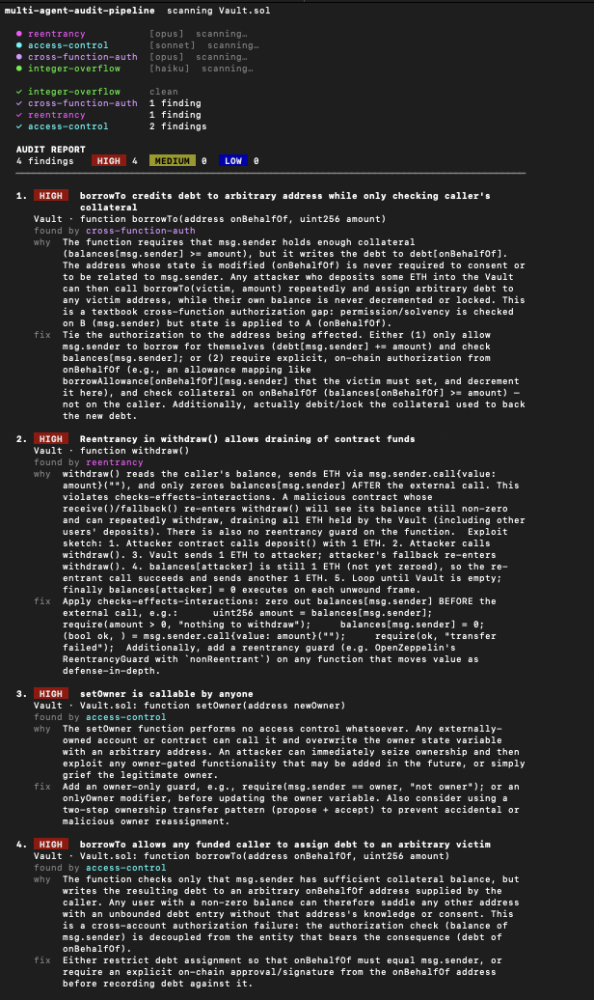

# multi-agent-audit-pipeline

[](https://github.com/Aboudoc/multi-agent-audit-pipeline/actions/workflows/ci.yml) [](LICENSE)

<!-- Real run of `python run.py examples/Vault.sol`. Swap for an animated GIF (asciinema -> agg / vhs) if you want motion. -->
<p align="center">
  
</p>

A tiny, readable **multi-agent Solidity audit pipeline**. An orchestrator fans an
audit out across a few focused agents — each hunts one bug class — then merges and
de-duplicates their findings. A few hundred lines of readable Python. No magic: a
loop, a few prompts, and a merge step.

It's a teaching scaffold, not a production auditor. The point is the *pattern* —
fan out to specialists, then merge — which you can extend with your own agents,
tools, and a PoC step.

> Companion code for the article *Build a multi-agent auditing pipeline*. If it
> saves you ten minutes, a ⭐ helps it reach more hunters.

## How it works

```
                        ┌── reentrancy           (opus)   ┐
   Solidity codebase ──►├── access-control       (sonnet) │
        (one blob)      ├── cross-function-auth   (opus)  ├──► merge + dedup ──► report
                        └── integer-overflow      (haiku) ┘     (track confirms)
                        each = 1 focused Claude call, on a model that fits the job
```

- **One job per agent.** A narrow prompt ("hunt only reentrancy") beats one
  kitchen-sink prompt, and the outputs are trivial to merge.
- **Right-size the model.** Each agent picks a tier that matches its difficulty —
  Haiku for a pattern scan, Sonnet for moderate reasoning, Opus for cross-function
  reasoning. Don't pay Opus prices for a grep.
- **Shared codebase, cached once.** The code is the stable prefix of every agent's
  prompt, so it caches and the agents reuse it. The per-agent focus is the only
  part that varies.
- **Structured output.** Each agent returns JSON matching a schema, so merging is
  just data, not string-scraping.
- **Merge keeps signal.** Same spot flagged by two agents → recorded as a
  confirmation, not a duplicate.

## Run it in 2 minutes

```bash
git clone https://github.com/Aboudoc/multi-agent-audit-pipeline
cd multi-agent-audit-pipeline
pip install -r requirements.txt

# Free: no API key needed — shows the plan and what each agent would do.
python run.py examples/ --dry-run

# For real: set a key, then audit the bundled vulnerable contract.
export ANTHROPIC_API_KEY=sk-ant-...
python run.py examples/Vault.sol
```

`examples/Vault.sol` ships with a reentrancy, an access-control bug, and a
cross-function-auth bug (debt credited to one address but checked against another) —
plus a clean arithmetic path, so you can watch the overflow agent correctly find
*nothing* (zero findings is a valid answer).

By default each agent uses its own model tier. Force one model for all of them
with `AUDIT_MODEL=claude-haiku-4-5 python run.py examples/Vault.sol` (or `--model`).

Output is a colored report with a live per-agent scan log (the scan log goes to stderr).
For a clean file, pass `--markdown`: `python run.py examples/Vault.sol --markdown > report.md`.

## Add your own agent

The four bundled agents (reentrancy, access-control, cross-function-auth, integer-overflow)
are deliberate starters — they teach the mechanics, not the edge. The leverage is in agents
that encode *your* expertise, where a generalist prompt loses to you: an accounting-drift
agent, a first-deposit-inflation agent, an oracle-manipulation agent.

Append one entry to `AGENTS` in `pipeline/agents.py`:

```python
Agent(
    name="first-deposit-inflation",
    model=HARD,  # HARD / MIDDLE / SIMPLE — pick the tier that fits the job
    focus="Hunt ONLY for first-deposit / share-inflation bugs in vault-style contracts: "
          "an attacker front-runs the first deposit and donates assets to skew the "
          "share/asset ratio so later depositors round down to zero shares. "
          "Ignore everything else.",
)
```

That's the extension point. The orchestrator picks it up automatically.

## Where to take it next

- **A PoC step.** Pipe high-severity findings into a Foundry test to confirm they're
  real before you trust them.
- **More tools.** Give agents `grep`/static-analysis output, or prior-art lookup, so
  they reason over facts instead of just the source.
- **Scoping.** Skip tests/mocks/`node_modules`; pin the commit you audited.

## Layout

```
run.py                  CLI
pipeline/
  agents.py             the agents (one focused prompt each) — your extension point
  llm.py                one Claude call per agent (the only file that hits the API)
  orchestrator.py       fan-out + merge/dedup
  report.py             colored report + live scan log (pure ANSI, no deps)
  codebase.py           load .sol files into one blob
  models.py             Finding shape + the JSON schema agents must fill
examples/Vault.sol      intentionally vulnerable demo contract
```

## License

MIT — see [LICENSE](LICENSE). Built by Reda Aboutika.
